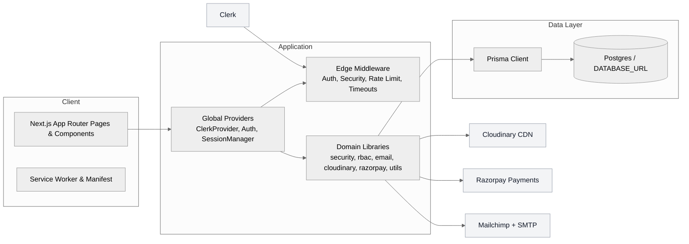

<p align="center">
  
</p>

<h1 align="center">Elanorra Living – Luxury Home Decor E‑commerce</h1>

<p align="center">
  Modern, production-ready e‑commerce with Next.js, TypeScript, Prisma, Clerk, Cloudinary, Razorpay, and Mailchimp/SMTP. Includes PWA, SEO, RBAC, rate limiting, and context‑aware session management.
</p>

<p align="center">
  <a href="https://img.shields.io/badge/Next.js-15-000000?logo=next.js"></a>
  <a href="https://img.shields.io/badge/TypeScript-5-3178C6?logo=typescript"></a>
  <a href="https://img.shields.io/badge/Prisma-ORM-2D3748?logo=prisma"></a>
  <a href="https://img.shields.io/badge/Clerk-Auth-3A76F0?logo=clerk"></a>
  <a href="https://img.shields.io/badge/Razorpay-Payments-0F72EA?logo=razorpay"></a>
  <a href="https://img.shields.io/badge/Mailchimp-Email-F5DE50?logo=mailchimp"></a>
  <a href="https://img.shields.io/badge/PWA-Ready-5A0FC8?logo=pwa"></a>
</p>

---

## Table of Contents
- Overview
- Architecture
- Quick Start
- Environment Variables
- Common Workflows
- Session Management
- Project Highlights
- Data Model Update (Shipment Tracking)
- API Changes
- UI Changes
- Email Updates

---

## Overview

Elanorra Living is a full‑featured e‑commerce platform for premium home decor. It focuses on performance, robust integrations, and a polished UX across browsing, checkout, and account management.

## Architecture



## Quick Start

- Requirements: Node `>=22.x`, npm `>=8.x`, Postgres `DATABASE_URL`
- Install dependencies: `npm install`
- Configure environment: create `.env.local` with the variables below
- Push schema: `npm run db:push`
- Seed data (optional): `npm run db:seed`
- Run dev server: `npm run dev`
- Open: `http://localhost:3000`

Quick Links
- Admin: `/admin`
- Shop: `/shop`
- Account: `/account`
- Checkout: `/checkout`

## Environment Variables

Core
- `NODE_ENV` — `development` or `production`
- `PORT` — defaults to `3000`
- `DATABASE_URL` — Postgres connection string

URLs & Branding
- `NEXT_PUBLIC_APP_URL` — public base URL used in metadata
- `NEXT_PUBLIC_BASE_URL` — public base URL used in emails
- `NEXT_PUBLIC_SITE_URL` — public site URL for emails
- `NEXT_PUBLIC_SITE_NAME` — display name for OpenGraph and UI
- `NEXTAUTH_URL` — used as base URL in emails and cron links

Auth (Clerk)
- `NEXT_PUBLIC_CLERK_PUBLISHABLE_KEY`

Cloudinary
- `CLOUDINARY_CLOUD_NAME`
- `CLOUDINARY_API_KEY`
- `CLOUDINARY_API_SECRET`

Payments (Razorpay)
- `NEXT_PUBLIC_RAZORPAY_KEY_ID`
- `RAZORPAY_KEY_SECRET`

Email & Newsletter
- `SMTP_HOST`, `SMTP_PORT`, `SMTP_USER`, `SMTP_PASSWORD`
- `FROM_EMAIL` — default `from` address
- `MAILCHIMP_API_KEY`
- `MAILCHIMP_API_SERVER` — e.g. `us1`
- `MAILCHIMP_AUDIENCE_ID`
- `MAILCHIMP_TRANSACTIONAL_API_KEY` — Mandrill key (optional)
- `ADMIN_EMAIL` — contact form destination

Security & Ops
- `CSP_ENABLED` — `true`/`false`
- `HSTS_ENABLED` — `true`/`false`
- `SECURITY_HEADERS_ENABLED` — `true`/`false`
- `ALLOWED_ORIGINS` — comma-separated list
- `SESSION_MAX_AGE` — seconds (default 30 days for cookies, not app timeout)
- `RATE_LIMIT_MAX_REQUESTS` — default `100`
- `RATE_LIMIT_WINDOW_MS` — default `900000`
- `CSRF_SECRET` — secret for CSRF tokens
- `DISABLE_CSRF` — `true` in dev to bypass (optional)
- `CRON_SECRET` — protects cron endpoints

Monitoring & Integrations (optional)
- `SENTRY_DSN`
- `DATADOG_API_KEY`
- `AWS_REGION`, `AWS_ACCESS_KEY_ID`, `AWS_SECRET_ACCESS_KEY`, `CLOUDWATCH_LOG_GROUP`
- `ERROR_WEBHOOK_URL`
- `HOSTNAME`
- `OPTIMIZE_API_KEY` — Prisma extension optimize

## Common Workflows

Local Development
- Start dev server: `npm run dev`
- Lint: `npm run lint`
- Build: `npm run build` then `npm start`

Database
- Push schema: `npm run db:push`
- Generate Prisma client: `npm run db:generate`
- Seed sample data: `npm run db:seed`
- Inspect database: `npm run db:studio`

Shipment Tracking
- Admin sets tracking details on `Admin → Orders → [orderId]` (tracking number, carrier, shipped at, ETA)
- Customers see tracking on `Account → Orders` and `Order Confirmation` with a “Track Package” button
- Supported carriers: FedEx, UPS, DHL, Bluedart, DTDC; fallback opens `Account → Orders`
- API: `PATCH /api/orders` accepts `{ orderId, trackingNumber?, carrier?, shippedAt?, estimatedDelivery?, fulfillmentStatus? }`
- Creation: `POST /api/orders` accepts optional tracking fields to prefill

Media
- Configure Cloudinary envs
- Use product image upload in Admin UI; assets are served via CDN

Payments
- Set Razorpay keys and test checkout flow under `/checkout`

Emails & Newsletter
- Configure SMTP and Mailchimp keys
- Newsletter endpoints under `src/app/api/newsletter/*`
- Cron routes use `CRON_SECRET`; see `src/lib/cron.ts`

## Session Management

- Context-aware session timeouts enforced on client and edge middleware:
  - Checkout: 15 minutes
  - Admin: 30 minutes
  - Cart/Orders: 1 hour
  - Default browsing: 2 hours
- Client: `src/components/auth/SessionManager.tsx` (activity tracking, warnings, multi-tab sync)
- Server: `src/middleware.ts` (redirects to `/sign-in?session_expired=true`)

## Project Highlights

- Next.js App Router structure with PWA and SEO
- Strong security posture: auth gating, security headers, rate limiting, CSRF helpers
- Rich integrations: Cloudinary, Razorpay, Mailchimp/SMTP
- Admin tooling and RBAC utilities
- Production-ready UX: offline page, sitemaps, metadata, error pages
- Shipment tracking: data model fields, admin controls, user-facing tracking links, email fallback fix

## Data Model Update (Shipment Tracking)

- Added fields to `Order` (Prisma):
  - `trackingNumber?: string`
  - `carrier?: string`
  - `shippedAt?: DateTime`
  - `estimatedDelivery?: DateTime`
- Run migration locally after pulling changes:
  - `npx prisma migrate dev --name add-shipment-tracking`
  - `npm run db:generate`

## API Changes

- `POST /api/orders`: now accepts optional shipment tracking fields
- `PATCH /api/orders`: update shipment tracking and optionally `fulfillmentStatus`
- Types updated in `src/lib/services/api.ts` and `src/types/index.ts`

## UI Changes

- Account Orders: shows tracking badge and “Track Package” with carrier-specific URL
- Order Confirmation: displays tracking details and “Track Package” button
- Admin Order Detail: new “Shipment Tracking” section to edit tracking fields and save

## Email Updates

- Tracking URL fallback in emails now routes to `/account/orders` instead of an invalid order-confirmation path

---

A complete, modern e-commerce website for premium home decor and lifestyle products. Built with Next.js 15, TypeScript, and Tailwind CSS with full WooCommerce-like functionality.

## 🌟 Features

### Core Functionality
- **Modern React Architecture**: Built with Next.js 15 App Router and TypeScript
- **Responsive Design**: Fully responsive across all devices (mobile, tablet, desktop)
- **Smooth Animations**: Beautiful interactions powered by Framer Motion
- **Shopping Cart**: Full cart functionality with persistent state using Zustand
- **Product Catalog**: Browse products with filtering and sorting options
- **Image Optimization**: Next.js Image component for optimal performance

### Design & UX
- **Hero Carousel**: Auto-playing image slider with manual controls
- **Product Cards**: Interactive cards with hover effects and quick actions
- **Navigation**: Multi-level dropdown navigation with search functionality
- **Toast Notifications**: User feedback for cart actions and interactions
- **Loading States**: Elegant loading animations and skeleton screens

### E-commerce Features
- **Product Management**: Categories, collections, and individual product pages
- **Cart Management**: Add, remove, update quantities with real-time totals
- **Wishlist**: Save favorite items (frontend implementation)
- **Search**: Product search functionality
- **Filtering**: Filter products by category and sort by various criteria

## 🛠 Tech Stack

- **Frontend**: Next.js 15, React 18, TypeScript
- **Styling**: Tailwind CSS v4, Custom CSS
- **Animations**: Framer Motion
- **State Management**: Zustand
- **Icons**: Heroicons
- **Image Handling**: Next.js Image component with Unsplash placeholders
- **Development**: ESLint, TypeScript compiler

## 📦 Installation & Setup

1. **Install dependencies**:
   ```bash
   npm install
   ```

2. **Run the development server**:
   ```bash
   npm run dev
   ```

3. **Environment Setup**
   ```bash
   # Configure your environment variables in .env file
   # Make sure to set all required variables for your environment
   ```

4. **Open in browser**:
   Navigate to [http://localhost:3000](http://localhost:3000)

## 🚀 Available Scripts

```bash
# Development
npm run dev          # Start development server with Turbopack

# Production
npm run build        # Build for production
npm run start        # Start production server

# Code Quality
npm run lint         # Run ESLint
```

## 📁 Project Structure

```
src/
├── app/                    # Next.js App Router pages
│   ├── layout.tsx         # Root layout with header/footer
│   ├── page.tsx           # Homepage
│   ├── shop/              # Shop pages
│   └── globals.css        # Global styles
├── components/            # React components
│   ├── layout/           # Layout components (Header, Footer, Cart)
│   ├── sections/         # Page sections (Hero, Featured Products)
│   └── ui/               # Reusable UI components
├── lib/                  # Utilities and data
│   ├── data/            # Mock data and constants
│   ├── store/           # Zustand state management
│   └── utils/           # Helper functions
└── types/               # TypeScript type definitions
```

## 🎨 Design System

### Colors
- **Primary**: Rose (rose-500, rose-600, rose-700)
- **Neutral**: Gray scale (gray-50 to gray-900)
- **Background**: White (#ffffff)
- **Text**: Gray-900 for headings, Gray-600 for body text

### Typography
- **Font**: Instrument Sans (Google Fonts)
- **Headings**: Bold weights (font-bold)
- **Body**: Regular and medium weights

## 🛍 E-commerce Features Implementation

### Product Data Structure
```typescript
interface Product {
  id: string;
  name: string;
  slug: string;
  description: string;
  price: number;
  compareAtPrice?: number;
  images: ProductImage[];
  category: string;
  collection?: string;
  inStock: boolean;
  featured: boolean;
  bestseller: boolean;
  newArrival: boolean;
}
```

### Cart Management
- Persistent cart state using Zustand and localStorage
- Add/remove items with quantity management
- Real-time price calculations
- Cart sidebar with smooth animations

### Navigation Structure
- Home
- Shop (with subcategories)
  - Tableware (Dining, Cups & Mugs, etc.)
  - Collections (Vasant, Anaar, Sundarbans, etc.)
  - Stationery
  - Gifting
- Our Story
- Services
- Contact

## 📱 Responsive Design

- **Mobile First**: Designed for mobile devices first
- **Breakpoints**: sm: 640px, md: 768px, lg: 1024px, xl: 1280px
- **Touch Friendly**: Appropriate touch targets and gestures
- **Cross-browser**: Compatible with modern browsers

## 🚀 Deployment

This Next.js application can be deployed on various platforms including Vercel, Railway, or any hosting service that supports Node.js applications.

Check out our [Next.js deployment documentation](https://nextjs.org/docs/app/building-your-application/deploying) for more details.

## 🎨 Inspiration

This project draws inspiration from modern lifestyle and tableware e-commerce experiences. All branding in this repository is intentionally generic to avoid referring to any specific company.

## 📈 Future Enhancements

- [x] User authentication and accounts
- [x] Real payment integration
- [x] Product reviews and ratings
- [x] Advanced search with filters
- [x] Email newsletters
- [ ] Order tracking
- [x] Admin dashboard

---

**Made with ❤️ using Next.js and modern web technologies**

## 🔐 Production Admin Setup

- Ensure `DATABASE_URL` is configured for your production database.
- Seed RBAC roles and permissions on production:
  - Set `SUPER_ADMIN_EMAILS` and/or `ADMIN_EMAILS` (comma-separated) in your environment.
  - Run `tsx prisma/rbac-seed.ts` locally against production DB or via your deployment process.
- First login creates a user with the default `USER` role; the seed upgrades specified emails to Admin/Super Admin.
- Legacy fallback: if a user has `isAdmin=true` but no role, admin capabilities are granted to prevent lockout; still run the RBAC seed to properly assign roles.
